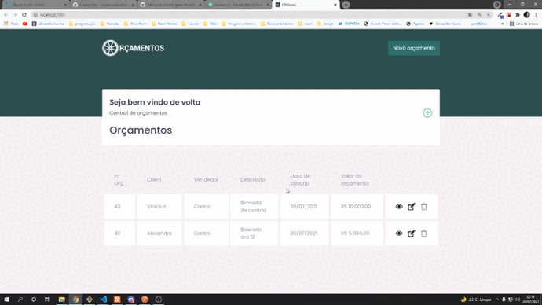

<p align="center">
  
</p>

## Backend

[Link do backend ReactJS](https://github.com/soualexandre/backend-teste-bot.git)

## Tech Stack

    - ReactJS
    - Axios
    
## Installation

Install my-project with yarn

```bash
  cd frentend-botOrcamentos
  yarn
  yarn start
```
    
